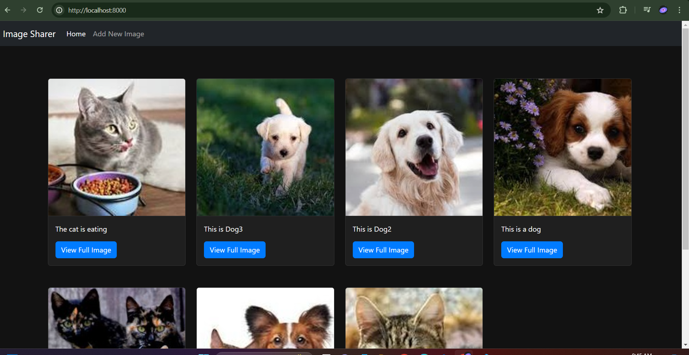
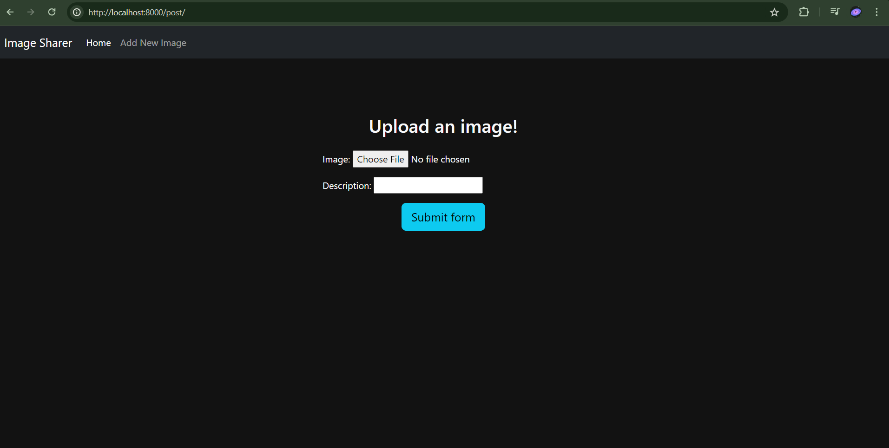
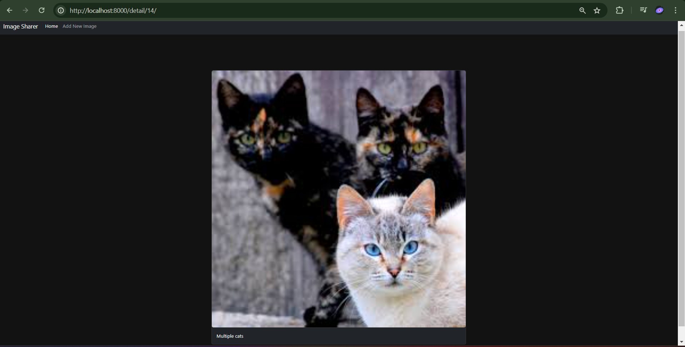

# Django Image Sharer

## Overview

This is a basic project built with Django. It is an image-sharing application where anyone can post their images, and they will appear on the home feed. The application is responsive and looks cool. 

## Features

- Users can post images.
- Images are displayed on the home feed in a card format.
- Each post has a "View Full Image" button that redirects to a detailed view page.
- Responsive design.
- Simple navigation with Home and Add Your Image options on the navbar.
- Uses Django's internal database for storage.

## Installation

1. **Clone the repository:**
    ```sh
    git clone https://github.com/AtharvaDeokar21/Image-sharer.git
    cd your-repository-name
    ```

2. **Create a virtual environment:**
    ```sh
    python -m venv env
    source env/bin/activate  # On Windows use `env\Scripts\activate`
    ```

3. **Install the required packages:**
    ```sh
    pip install -r requirements.txt
    ```

4. **Run migrations:**
    ```sh
    python manage.py migrate
    ```

5. **Create a superuser (optional, for accessing the Django admin):**
    ```sh
    python manage.py createsuperuser
    ```

6. **Run the development server:**
    ```sh
    python manage.py runserver
    ```

7. **Access the application:**
    Open your browser and go to `http://127.0.0.1:8000/`

## Usage

- **Home**: View the feed of posted images.
  - Each image appears in a card format with an option to view the full image.
  - Clicking "View Full Image" redirects to a detailed view page.
- **Add Your Image**: Upload a new image to share with others.

## Screenshots





## Technologies Used

- Django
- Bootstrap (for responsive design)
- Python

## Contributing

Contributions are welcome! Please fork the repository and use a feature branch. Pull requests are warmly welcome.

## License

This project is licensed under the MIT License - see the [LICENSE](/LICENSE) file for details.

## Acknowledgments

- Thanks to the Django community for their support and contributions.
- Bootstrap for providing the responsive design framework.

## Contact

If you have any questions or feedback, feel free to reach out to me at [atharva.deokar2005@gmail.com].
[Linkedin](www.linkedin.com/in/atharva-deokar-70643628b)

